# kottans-frontend 2022 online courses

# 1. Git та GitHub

- ## Coursera 1 & 2 week:

  
1 week:

  

  
2 week:

  

Достаточно сложно воспринимать информацию на английском, когда нужно читать субтитры и ещё смотреть за происходящем на экране. 
В целом от курса пложительные впечатления.

- ## learngitbranching.js.org:

  
Основы

  

  
Удалённые репо

  

Очень много полезной информации узнал для себя. Как бы не было лень учить git, но без него никуда.
Понравился сервис, хоть и немного затянуто всё по задачам, как по мне.

# 2. Linux CLI, and HTTP

- ## Linux Survival (4 modules):

  
Quiz 1:

  

В первой ветке практически все команды были знакомы, прохождение данного квиза не вызвало трудностей.

  
Quiz 2:

  

  
Quiz 3:

  

  
Quiz 4:

  

Остальные 3 квиза были сложнее, но на то мы и учимся)) Думаю в будущем какая-то часть команд мне точно пригодится, как минимум создание/удаление файлов, папок, копирование целых веток, завершение процессов через консоль будут полезны.

Отдельно хотелось бы отметить 2 статьи по HTTP, честно говоря как-то они очень туго у меня шли, в том плане, что много технических терминов, которые без практики заполнить очень сложно, есть гугл для этого. И на начальном этапе я не уверен, что это мне действительно пригодится, разве что ajax запросы к серверу, о которых там писали))

# 3. Git Collaboration

- ## Coursera 3 & 4 week:

  
3 week:

  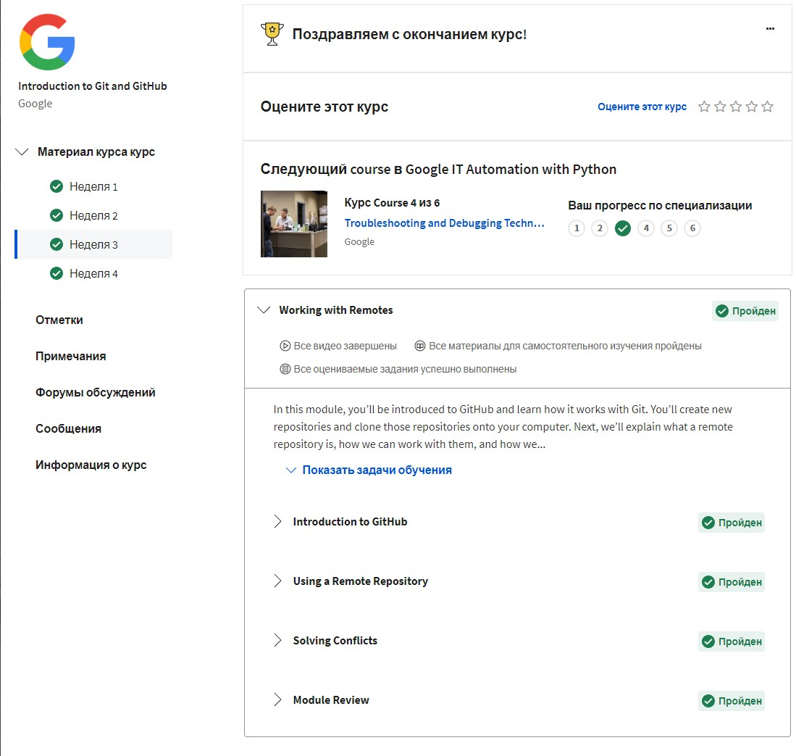

  
4 week:

  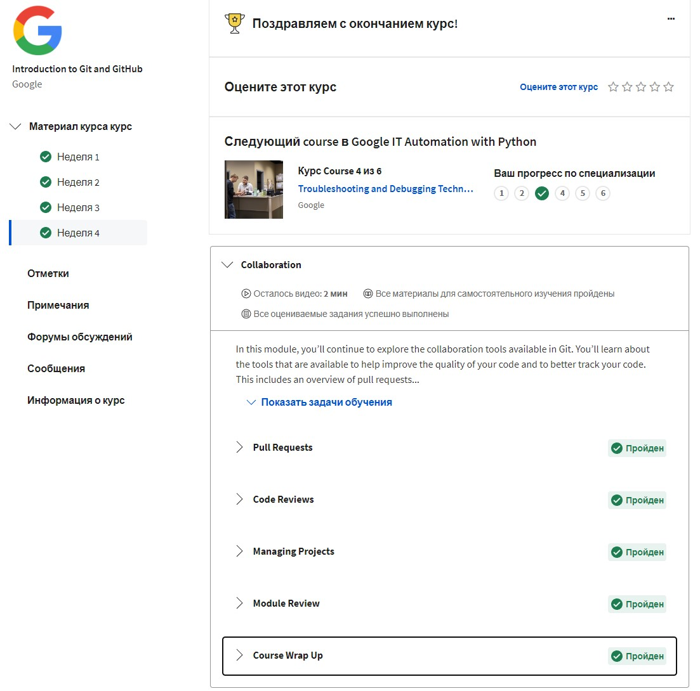

Эти 2 недели лекций пригодились бы, когда мы форкали ваш репо и делали PR. Как раз в данных лекциях всё разжевали, но я их увидел поздно))

- ## learngitbranching.js.org:

  
Основы

  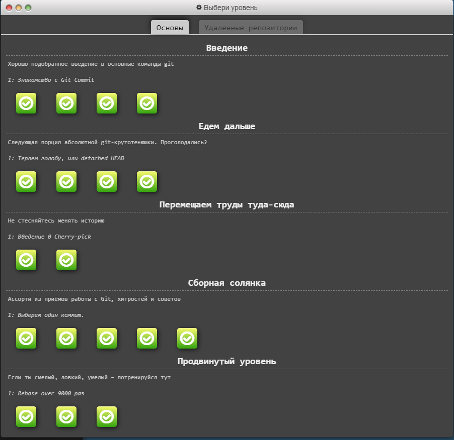

  
Удалённые репо

  

# 4. Intro to HTML and CSS

- ## Coursera 1 & 2 week:

  
1 week:

  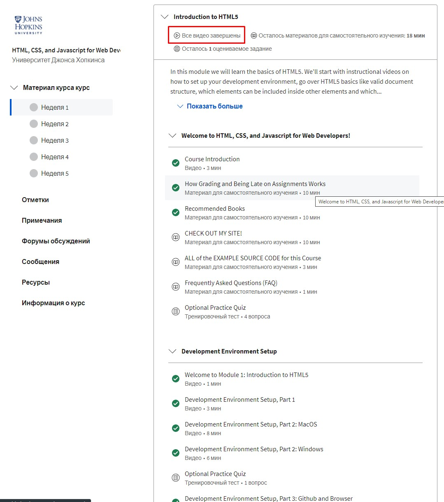

  
2 week:

  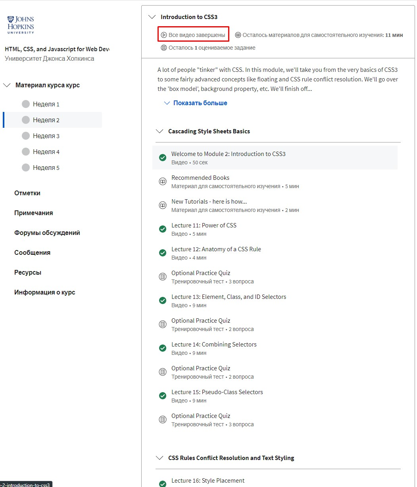

Прошёл данные курсы в ускоренном режиме, до этого учил HTML/CSS, так что вся информация мне знакома. Но если бы сейчас начинал с нуля, то были бы большие трудности. Снова таки, материал на английском, субтитры плохие, воспринимать материал тяжело.

- ## Learn HTML & CSS (codecademy):

  
HTML + CSS screen

  

- HTML:
> Некоторые вещи для себя взял на вооружение (создание аудио, видео контента на сайте, теги figure, figcaptcha)
> Очень полезно было хорошенько по формам пройтись и валидации, использование регулярных выражений в атрибутах тоже очень полезная фича.

- CSS:
>Наконец-то загрузил шрифты не через линк с гугла, а через импорт в CSS @font-face. Раньше не применял на практике, хоть и знал, что есть такая возможность, руки никак не доходили.

# 5. Responsive web design

- Статья Responsive web design basics.
> Полезная информация, многое из статьи использовал ранее и был с этим знаком. Нашёл для себя классный иснтрумент, который точно буду использовать в дальнейшем - Lighthouse, для проверки качества вёрстки страницы и её оптимизации. 
>Так же исправлю верстку в своих проектах, где не всегда явно задавались размеры картинок на страницах, нашёл несколько багов с пустыми href и косяками картинок, без webpi формата, так же поправлю в дальнейшем.

- ## CSS FlexBox

  
Screen:

  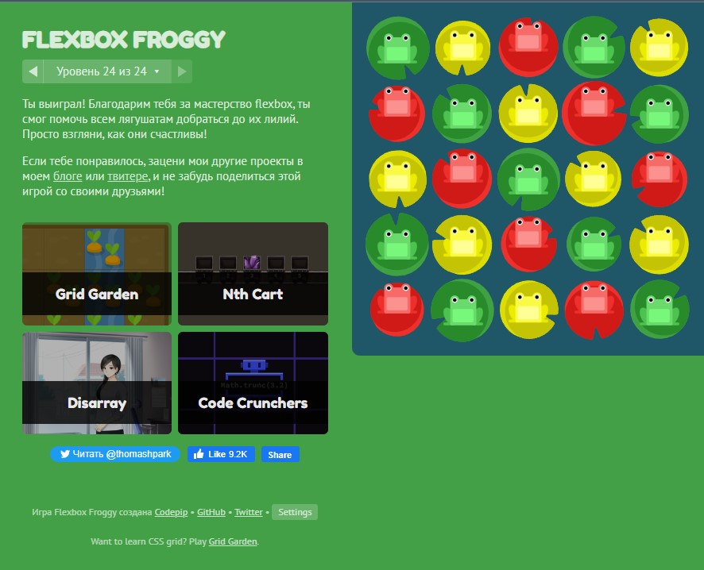

- ## CSS Grid:

  
Screen:

  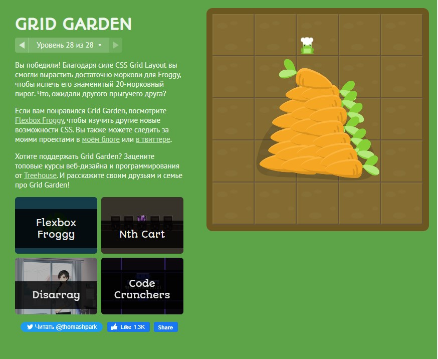

# 6. HTML-CSS-Popup

[DEMO](https://dmytryjk.github.io/Hooli-style/)

# 7. JS Basics

- ## Coursera 4week

  
Screen:

  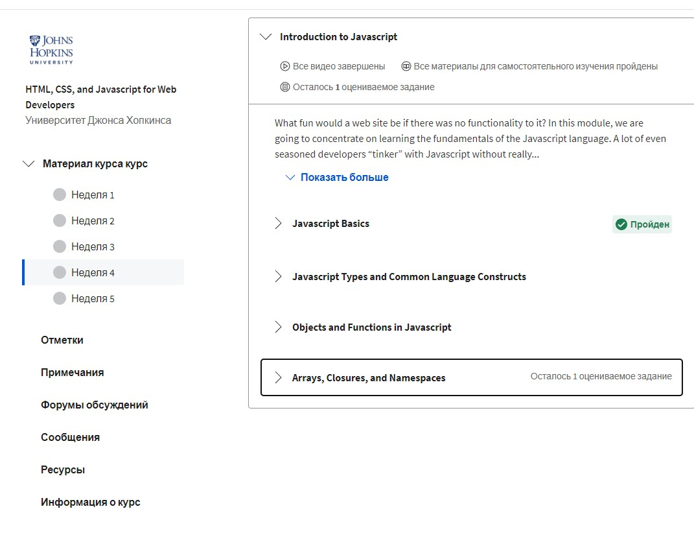

> В целом многое из видео по базовому JS мне знакомо, хотелось бы видеть курс не 2015-го года :) Конечно, основы они +- актуальны, но всё же, когда человек только начинает изучать JS - лучше сразу иметь актуальную информацию.

- ## FreeCodeCamp 

  
Basic JavaScript:

  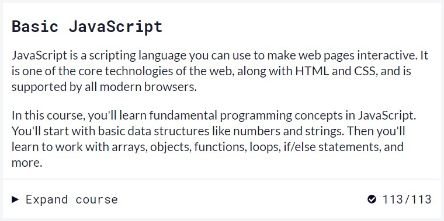

  
ES6 Challenges:

  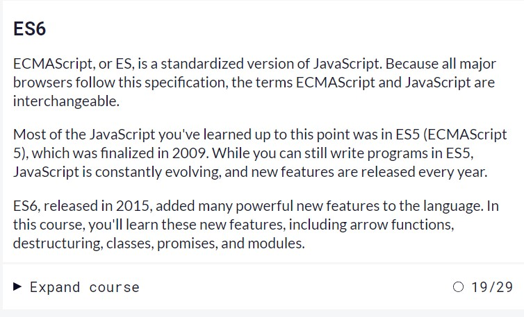

  
Basic Data Structures:

  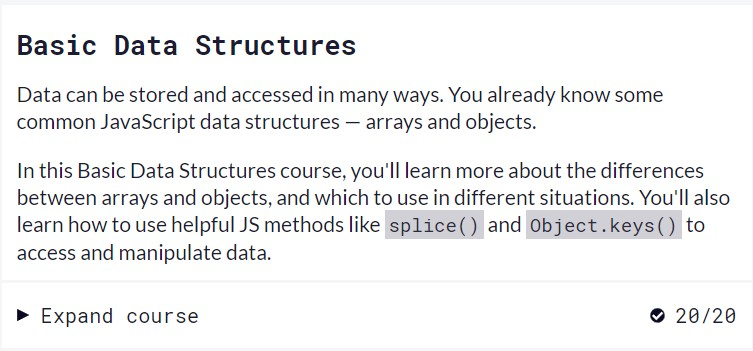

  
Basic Algorithm Scripting:

  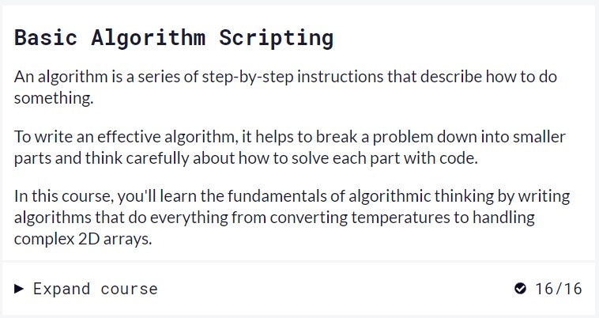

  
Functional Programming:

  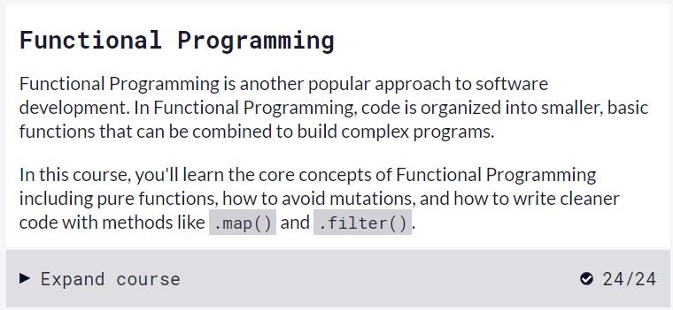

  
Algorithm Scripting Challenges:

  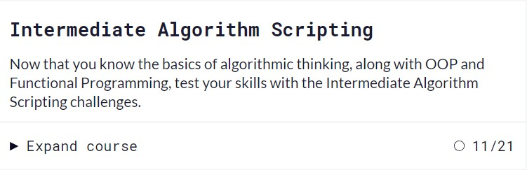

> Моему горению нет предела. Это было сложно, именно морально, очень тяжело себя мотивировать проходить задачи в таком количестве дней 5-6, особенно по последним пунктам, когда далеко не всё получается. Первая сотня улетела очень быстро, т.к. там основы и я это +- понимаю. Но вот с последними пунктами была прям беда, 3-4 часа у меня уходило не на весь раздел, а на несколько задач и то, в конце не всегда хватало терпения довести всё до конца, подглядывал в подсказки логику решения.

> Поработал с методами filter, map, reduce, раньше в них как-то не углублялся. Знал что они есть и на этом все. Честно говоря не очень были понятны объяснения из FreeCodeCamp, пришлось смотреть отдельное видео на ютубе, где разложили материал по полочкам.

> Ещё заметил, что было тяжело работать со строками, из-за того, что раньше сильно в методы работы с ними не вникал.

> Определённо курс был полезен, хоть и достаточно сложный для меня. В общем, я был очень доволен, когда с этим закончил и смог приступить к задаче по DOM-JS, прямо кайфанул))

# 8. JS DOM task

- ## Coursera 5week

  
Screen:

  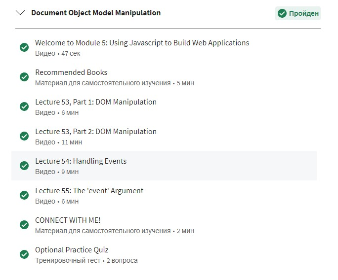

> С домом раньше работал, видео было достаточно просто воспринимать.

- ## FreeCodeCamp 

  
Screen:

  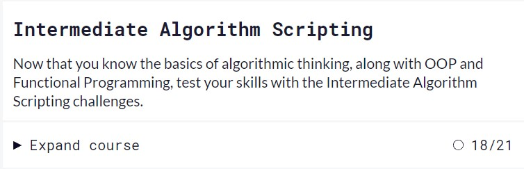

> Мой любимчик :) 

[DEMO](https://dmytryjk.github.io/DOM%20Object%20Model/)

# 9. Building a Tiny JS World (pre-OOP)

[DEMO](https://dmytryjk.github.io/a-tiny-JS-world/)

# 10. Object Oriented JS

- [DEMO](https://dmytryjk.github.io/frontend-nanodegree-arcade-game/)
- [Code Base](https://github.com/DmytryjK/frontend-nanodegree-arcade-game)

- ## Codewars

  
Screen:

  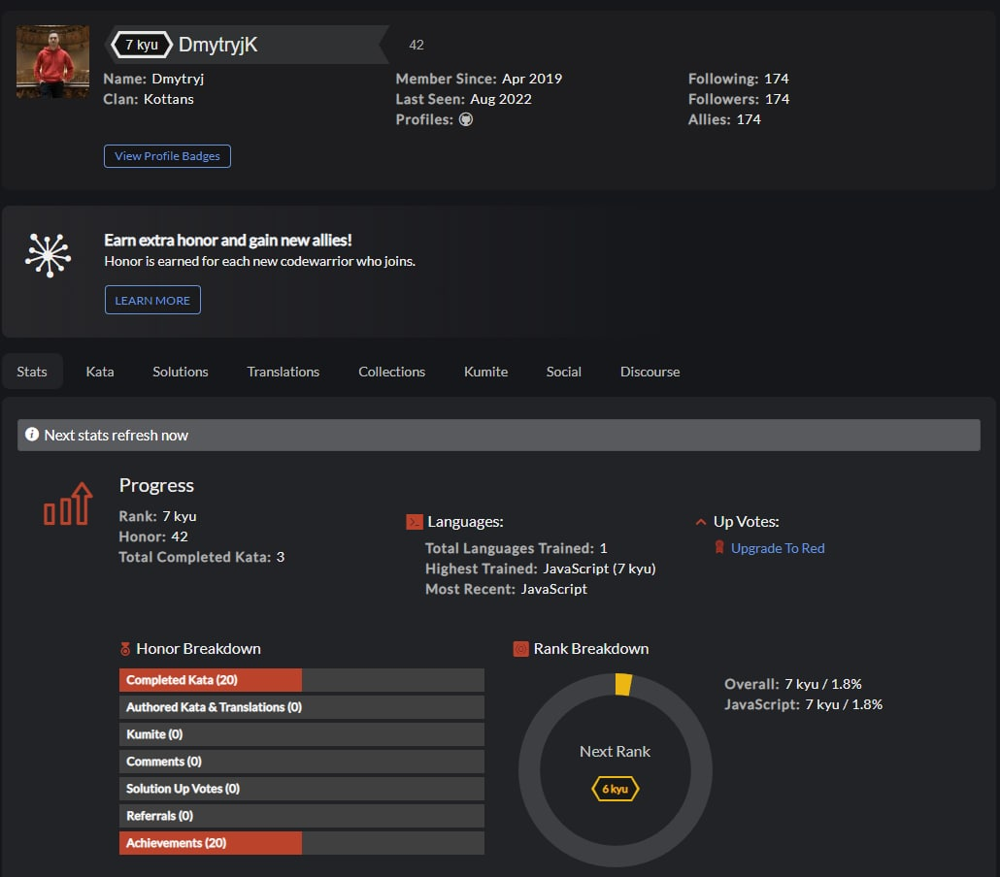

